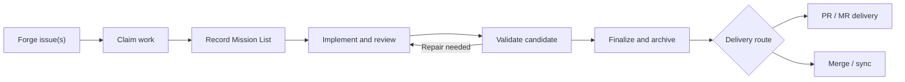
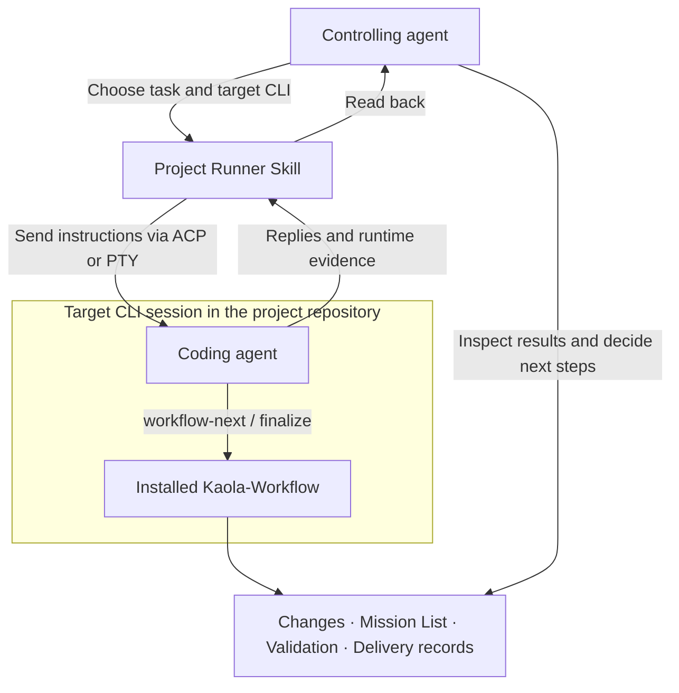
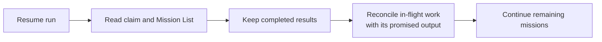

# Kaola-Workflow

**A recoverable engineering workflow for coding agents, from issue to verified delivery.**

Kaola-Workflow connects issue claims, a resumable Mission List, validation evidence, and delivery
records across **nine coding runtimes** and **GitHub, GitLab, and Gitea**. The agent plans,
executes, reviews, and judges completion; Workflow records the run and provides the scripts for
claiming, validation, finalization, and delivery.

[Quick start](#quick-start) · [Project Runner synergy](#project-runner-synergy) ·
[Runtime support](#runtime-and-forge-support) · [Documentation](docs/README.md)

## From issue to delivery



The forge holds the backlog; Git holds the changes; local run files preserve progress and evidence.
Finalization reconciles documentation and issue closure, then records the archive and delivery
outcome. **A delivered PR/MR is distinct from a merged change.**

| Capability | What it gives you |
|---|---|
| Claims and worktrees | Single-issue or multi-issue runs, collision-safe claims, optional isolated worktrees |
| Recoverable execution | One Mission List records outcomes, in-flight work, and where evidence should land |
| Native agent collaboration | Seven focused role behaviors on profile-supporting runtimes; native dispatch elsewhere |
| Verifiable delivery | Candidate-bound validation receipts, closure records, archive, and merge/sync or PR/MR delivery |
| Consistent instructions | A shared global contract, project-specific instructions, and runtime-specific recovery carriers |

The agent chooses decomposition and dispatch. The Mission List preserves those decisions across
interruptions; it introduces no scheduler or execution graph.

## Project Runner synergy

[**Kaola Project Runner**](https://github.com/KaolaBrother/kaola-project-runner) lets one agent work
through another agent's CLI. **Runner carries the conversation; Workflow structures the engineering
work.** Each project can be used independently.



Install the Runner Skill for the **controlling agent** and Workflow for the **target CLI**.
The controlling agent starts an owned session, requests `workflow-next`, inspects the work and
validation evidence, supervises finalization, and stops that session when finished.

> Use Claude Code through Kaola Project Runner to work on issue #42 in this repository. Follow
> its installed Workflow Next instructions, inspect the changes and validation evidence, then
> supervise finalization through PR delivery. Stop the owned session when finished.

Runner reports CLI observations; the agent decides whether the task is complete. Starting Runner
alone does not install or invoke Workflow. Runner currently provides **seven target CLI Skills**;
Workflow additionally supports **ZCode and Droid** as native CLI editions. Transport and recovery
capabilities vary by target.
See [Runner setup and support](https://github.com/KaolaBrother/kaola-project-runner#agent-runtime-support).
The projects have [separate licenses](https://github.com/KaolaBrother/kaola-project-runner#license-and-use).

## Quick start

Requirements: **Git, Node.js, a supported coding runtime, and an authenticated forge CLI/API setup**
(`gh` for GitHub, `glab` for GitLab, or a compatible Gitea setup).

```bash
git clone https://github.com/KaolaBrother/Kaola-Workflow.git ~/kaola-workflow
cd ~/kaola-workflow
./install-all.sh --yes --forge=github
./install-all.sh --check
```

Use `--forge=gitlab` or `--forge=gitea` as appropriate. The installer refreshes detected local
runtime carriers. **Codex also needs a matching marketplace plugin entry; Cursor Cloud needs a
saved environment and a fresh top-level Agent.** Follow the [installation guide](docs/installation.md)
for those steps, installation scopes, and hook trust.

Open your project in the installed runtime, then use its native command or Skill:

| Entry | When to use it | Result |
|---|---|---|
| `workflow-init` | First setup, or when project facts change | Repository instructions based on verified local facts; existing owner-authored rules require authorization to rewrite |
| `workflow-next` | Start or resume an issue or issue bundle | Claim, Mission List, execution, and evidence |
| `kaola-workflow-finalize` | All missions are complete | Final validation, documentation, closure, archive, and delivery |

```text
Use Workflow Next to finish issue #42, then finalize it.
```

A named issue takes precedence over automatic selection. The agent continues within the authorized
scope and investigates missing facts; unresolved scope or acceptance decisions go back to the user.
A research or design request does not authorize implementation. See [Task Quality](docs/task-quality.md).

## Runtime and forge support

| Runtime | Native workflow carrier | Kaola role profiles | Install entry |
|---|---|---|---|
| Claude Code | Commands and `CLAUDE.md` bridge | Seven named agents | `./install.sh` |
| Codex | Skills and `AGENTS.md` | Seven TOML agents per plugin | Matching plugin + profile installer |
| Cursor CLI/App/Cloud | Commands and persistent recovery Rule | Seven named agents | `./install-cursor.sh` |
| Grok CLI | Commands and persistent recovery Rule | Seven named agents | `./install-grok.sh` |
| OpenCode | Commands | Native dispatch | `./install-opencode.sh` |
| Kimi Code | Skills | Native dispatch | `./install-kimi.sh` |
| ZCode | Commands | Native dispatch | `./install-zcode.sh` |
| Devin CLI | Inline skills | Native `run_subagent` | `./install-devin.sh` |
| Droid CLI | Inline skills | Native Task `worker`/`explorer` | `./install-droid.sh` |

All forge-aware installers accept `--forge=github|gitlab|gitea`; Codex selects its forge through the
installed plugin. Models, dispatch, hooks, and recovery retain each runtime's measured capabilities.
See [Runtime Capabilities](docs/runtime-capabilities.md) and the
[edition guides](docs/README.md#runtime-editions) for defaults, setup, and evidence limits.

<details>
<summary>Cursor CLI startup and resume</summary>

Cursor CLI `workflow-next` startup and resume share one `.cursor/commands` file. On the CLI/local
(`product=cli`) route, claim.js verifies a CLI-shaped ancestor with `--workspace` sharing Git
identity, then runs installed `--ensure-target` against that directory. An unrelated tool's generic
`--workspace` skips ensure. `--worker-dir`, with or without `--workspace`, is App-like and skips
ensure; App/Cloud do not receive CLI preparation. See the [Cursor guide](docs/cursor-edition.md).

</details>

## Durable state

```text
kaola-workflow/
├── <run>/
│   ├── workflow-state.md   # claim, branch, worktree, closure, delivery
│   ├── mission-list.md     # item / status / dispatched / result
│   └── .cache/             # run-selected evidence
└── archive/                # completed runs
```



Each mission is written at creation, before dispatch (including the output location), and when its
result lands. Completed results are immutable; changes to validated content invalidate affected
PASS evidence. Finalization, closure, archive, and delivery are recorded separately from missions.

See [Workflow State Contract](docs/workflow-state-contract.md) for resume and archive identity rules,
and [The Mission List](docs/decisions/0017-the-mission-list.md) for the design.

## Token usage at a glance

Approximate **static prompt footprint for v12.0.1**, using the generated GitHub edition:

| Runtime | Workflow Next | Finalize | Global rule | Combined, one copy each |
|---|---:|---:|---:|---:|
| Claude Code | 2,760 | 3,140 | 490 | 6,390 |
| Codex | 2,710 | 3,000 | 490 | 6,200 |
| Cursor | 2,280 | 2,560 | 1,550 | 6,390 |
| Grok CLI | 1,900 | 2,290 | 1,370 | 5,560 |
| Devin CLI | 1,930 | 2,350 | 1,340 | 5,620 |
| Droid CLI | 1,930 | 2,360 | 1,390 | 5,680 |
| Kimi Code | 2,610 | 3,030 | 490 | 6,130 |
| OpenCode | 2,610 | 3,030 | 490 | 6,130 |
| ZCode | 2,630 | 3,030 | 490 | 6,150 |

Each component is estimated as whitespace-separated words × 1.5, rounded to the nearest 10 tokens;
the total sums one copy of each displayed component. **These are not tokenizer measurements or
actual task costs.** Init, role prompts, separate recovery injections, vendor/project instructions,
history, tools, reasoning, and output are excluded. Repetition, caching, and compaction affect usage.
See [raw counts and reproduction](docs/prompt-size.md).

## Update and remove

```bash
cd ~/kaola-workflow
git pull --ff-only
./install-all.sh --yes --forge=github
./install-all.sh --check
```

When upgrading from before v12, reinstall on **every machine** to remove retired role profiles.
Rebuild Cursor Cloud's saved environment separately. Workflow installers update Workflow carriers;
target CLIs and desktop applications have their own update process.

For removal, use the [scope-specific uninstall instructions](docs/installation.md#uninstall).

<details>
<summary>Release surface versions</summary>

Maintained by the release transaction:

- Codex `kaola-workflow` plugin manifest: `12.0.1`
- Codex `kaola-workflow-gitlab` plugin manifest: `12.0.1`
- Codex `kaola-workflow-gitea` plugin manifest: `12.0.1`
- Claude Code command install, GitHub edition: `12.0.1`
- Claude Code command install, GitLab edition: `12.0.1`
- Claude Code command install, Gitea edition: `12.0.1`

</details>

## Documentation and development

| Reference | Covers |
|---|---|
| [Installation](docs/installation.md) | Setup, scopes, updates, diagnostics, uninstall |
| [Architecture](docs/architecture.md) | Component boundaries and data flow |
| [API](docs/api.md) | Script commands, schemas, configuration, integration contracts |
| [Conventions](docs/conventions.md) | Testing, generation, review, release, Git rules |
| [Agent Sources](docs/agents-source.md) | Seven role behaviors and provenance |
| [Documentation index](docs/README.md) | Runtime guides, state contracts, and design decisions |

For repository development:

```bash
npm test
node scripts/simulate-workflow-walkthrough.js
```

Edit sources under `templates/` or the shared kernel, then regenerate commands, skills, runtime
profiles, and forge mirrors. See the API and Conventions for focused checks and release validation.

## License

[MIT](LICENSE). Role behavior sources and history are documented in [Agent Sources](docs/agents-source.md).
